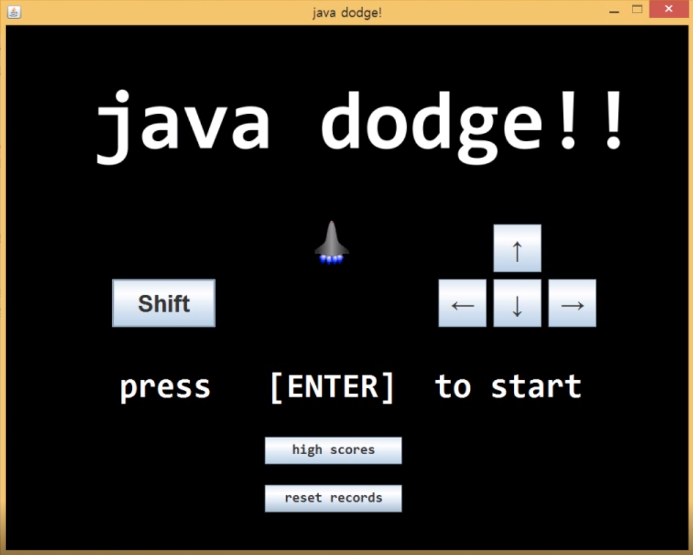
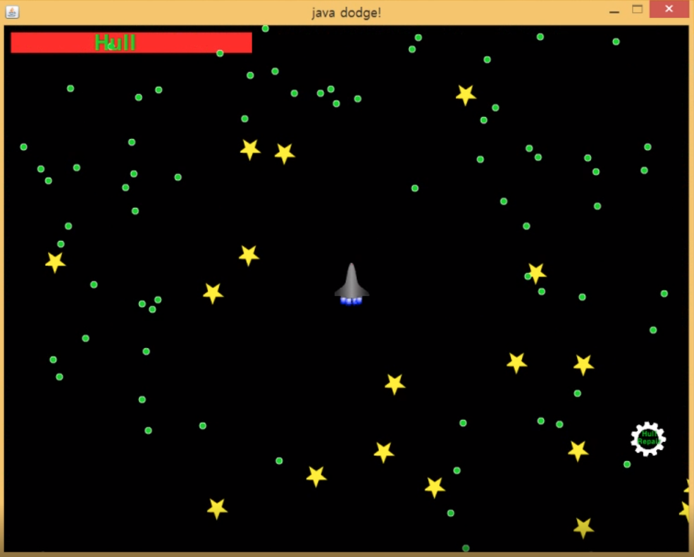
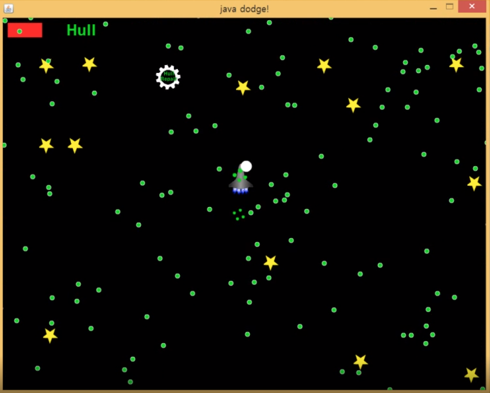
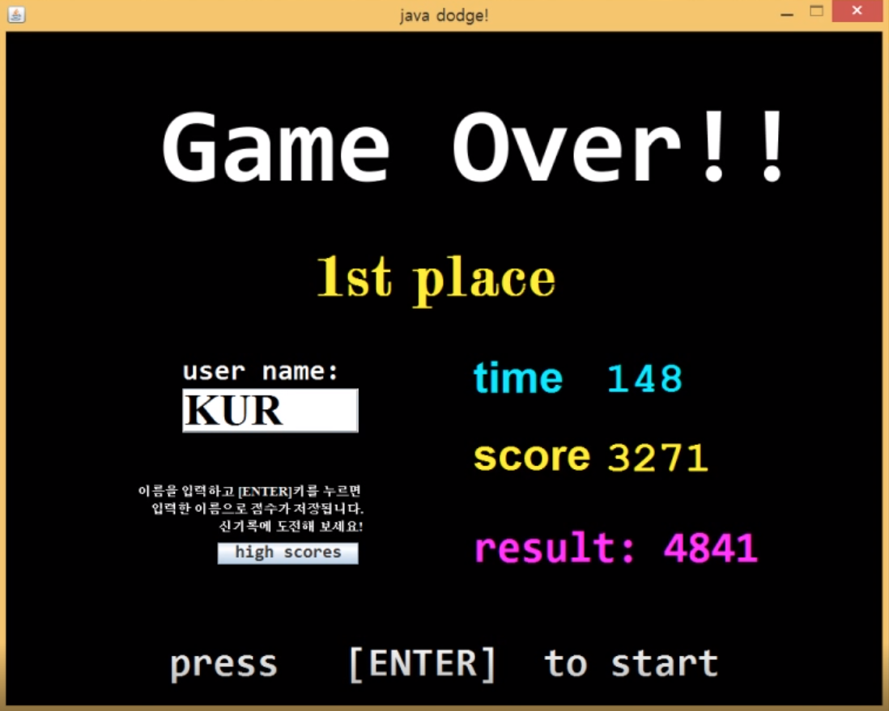
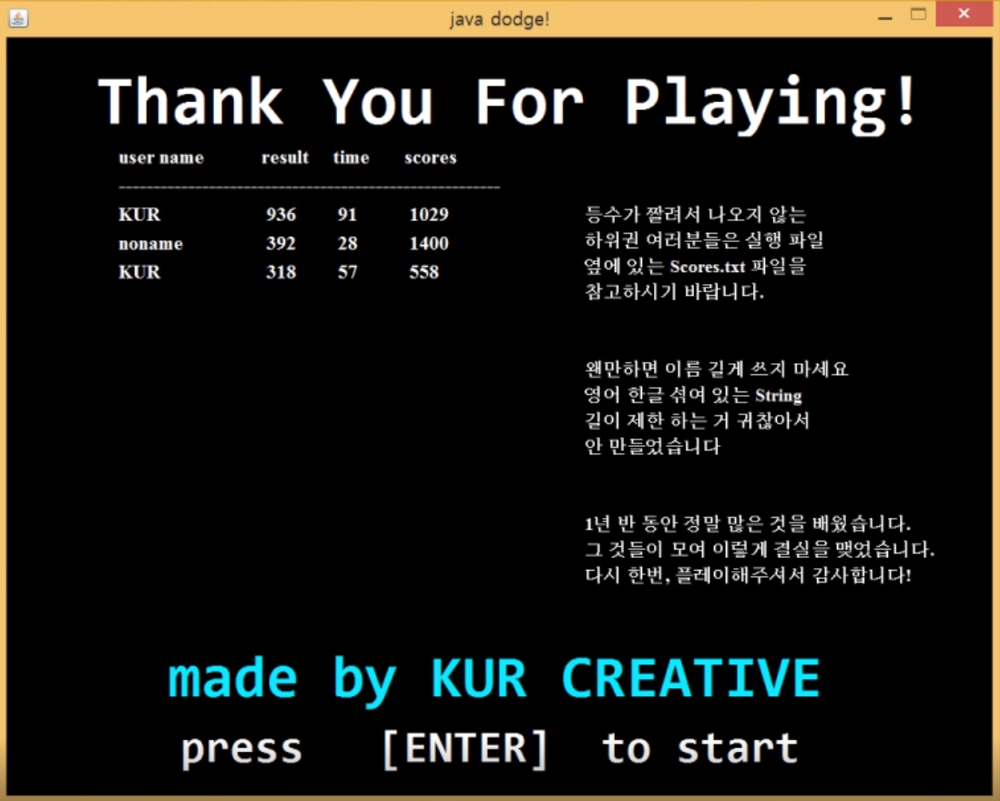

# java-dodge
My old term project

http://blog.naver.com/rhdnfka94/220731600818 \
https://blog.naver.com/rhdnfka94/220731600818

소스 코드를 원하는 분이 계셔서 공개합니다. \
이걸 만들었던 컴퓨터를 포맷해서 이제는 볼 수 없게 되버렸어요..

네이버 영상이라 영상을 못 붙여 넣네요.. 유튜브에 올리고 싶은데

## files
[final-decompiled](https://github.com/KUR-creative/java-dodge/tree/master/final-decompiled): \
jar 파일을 디컴파일한 소스코드입니다. 최종버전입니다. 

[java_dodge_mid_dev_proj](https://github.com/KUR-creative/java-dodge/tree/master/java_dodge_mid_dev_proj): \
옛날 메일함에서 발견한 프로젝트 폴더입니다. 이클립스에서 짰던 기억이 납니다. 아무래도 개발 중간 버전인 것 같네요. 

[java_dodge_mid_dev_src](https://github.com/KUR-creative/java-dodge/tree/master/java_dodge_mid_dev_src): \
위 프로젝트 폴더에서 이미지와 소스코드만 빼낸 겁니다.주석이 좀 달려 있습니다. 

## thinkings
이거 2학년 1학기에 OOP 텀프로젝트였습니다. 자바로 짜야 했었죠. \
물론 주제는 자유였습니다. 객체 지향 막바지에 쓰레드랑 GUI를 소개했는데 그걸 쓰는 프로그램을 하나 만들라는 거였습니다. \
그래서 기회는 이때다 하고 바로 게임 박아버림 ㅋ 

자바 swing이랑 awt로 게임 엔진 없이 밑단부터 만든 프로젝트입니다. \
애니메이션도 제가 만들었었는데 옛날에 플래시 게임 만들 때 그려뒀던 MovieClip을 png로 export해서 스프라이트를 만들었어요. \
스프라이트 시트를 [애니메이션](https://github.com/KUR-creative/java-dodge/blob/master/java_dodge_mid_dev_src/src/dodge/Animation.java)으로 만들어야 하는데 그것도 직접 짰네요 지금 보니. \
이야 [히트테스트](https://github.com/KUR-creative/java-dodge/blob/a2d350c0fbfa8f7fbbc0a14de2ca4c1accced351/java_dodge_mid_dev_src/src/dodge/GameObject.java#L66)도 직접 만들었어요. 상자 써가지고 ㅋㅋㅋ \
[state transition](https://github.com/KUR-creative/java-dodge/blob/master/java_dodge_mid_dev_src/src/dodge/SceneManager.java)도 보아하니 다 switch case로 구현된 거 같습니다 하하.. \
이 때는 아직 TDD에 빠지기 전이라 테스트는 없네요. 테스트 폴더만 있고 텅 비어 있습니다. \
오랜만에 보니 재밌네요.

기억 나는 바로는 이것 저것 필요한 지식을 얻은 다음에 \
본격적으로 만든 건 한 이틀하고 반나절만에 후다닥 만들었던 것 같습니다. 

제 기억에는 졸라 드러운 코드였다고 생각했는데 생각보다는 깔끔했네요; \
꽤 재밌었던 기억이 납니다. 

혼자서 했지만 제가 유일하게 해본 해커톤이었던 것 같습니다.
